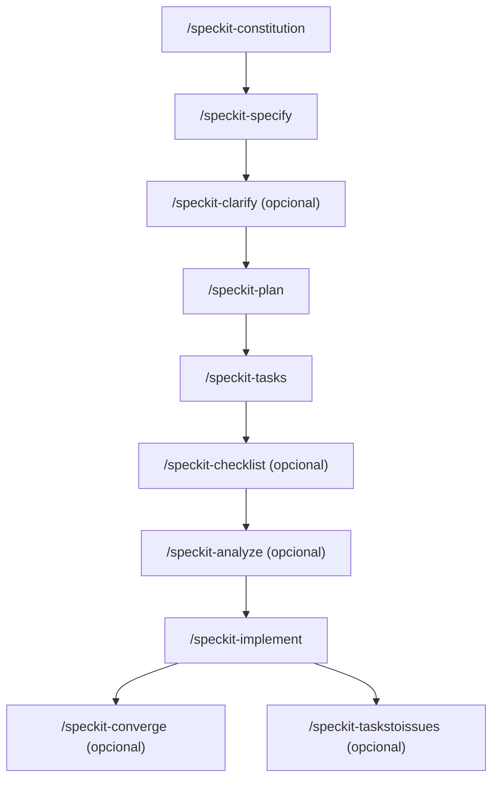

# Cómo usar Speckit (Spec Kit)

Guía de instalación y uso de [Speckit](https://speckit.org/), el toolkit de *Spec-Driven Development* de GitHub, aplicado a este proyecto (**TargetGYM**).

---

## 1. Instalación

Speckit se instala como una herramienta de línea de comandos (`specify`) usando [`uv`](https://docs.astral.sh/uv/) (gestor de paquetes/herramientas de Python).

### 1.1 Instalar `specify-cli`

```powershell
uv tool install specify-cli --from git+https://github.com/github/spec-kit.git
```

- Descarga el proyecto `spec-kit` directo del repositorio de GitHub.
- Lo instala como herramienta global de `uv` (no queda atado a un proyecto puntual).
- Deja disponible el ejecutable `specify` en el PATH.

### 1.2 Verificar instalación

```powershell
specify --version
```

Debería devolver algo como `specify 1.0.13.dev0`.

### 1.3 Inicializar Speckit en un proyecto

```powershell
specify init . --integration copilot --force
```

| Argumento | Qué hace |
|---|---|
| `.` | Inicializa en el directorio actual (en vez de crear una carpeta nueva). Si querés una carpeta nueva, usá `specify init nombre-proyecto` en su lugar. |
| `--integration copilot` | Configura la integración con GitHub Copilot como agente de código (el flag correcto es `--integration`, **no** `--ai`, que es de versiones viejas del CLI). |
| `--force` | Salta la confirmación interactiva cuando la carpeta ya tiene archivos (necesario si el directorio no está vacío). |

Durante la ejecución también te pregunta el tipo de script (`sh`, `ps` o `py`); en Windows conviene `ps` (PowerShell).

Esto crea la infraestructura base:
- `.specify/` → scripts, templates, memoria (constitution), configuración.
- `.github/skills/speckit-*` → las skills/comandos que usa el agente.

---

## 2. Flujo de trabajo y orden de comandos

Speckit sigue un flujo secuencial de *Spec-Driven Development*. El orden recomendado es:



Todos los comandos se ejecutan escribiéndolos como *slash commands* en el chat del agente (Copilot), por ejemplo:

```
/speckit-specify Quiero una landing page para TargetGYM con planes de membresía
```

Lo que escribas después del comando es el **argumento** (`$ARGUMENTS`), es decir, la descripción en lenguaje natural de lo que querés lograr.

---

## 3. Comandos, uno por uno

### 3.1 `/speckit-constitution`

**Qué hace:** crea o actualiza el archivo `.specify/memory/constitution.md`, que define los principios de gobernanza del proyecto (reglas no negociables: calidad, seguridad, estilo, testing, etc.). Este archivo es leído por todos los demás comandos como referencia obligatoria.

**Cuándo usarlo:** primero, una sola vez al arrancar el proyecto (y cada vez que quieras enmendar los principios).

**Argumentos:** texto libre describiendo los principios que querés establecer. Ejemplo:

```
/speckit-constitution El proyecto prioriza accesibilidad, código simple y mobile-first. Todo componente debe ser responsive y testeado antes de mergear.
```

**Por qué va primero:** las especificaciones, planes y tareas posteriores se validan contra esta constitución. Si hay conflicto con un principio "MUST", los comandos posteriores (`/speckit-analyze`, `/speckit-converge`) lo marcan como error crítico.

**Notas:**
- Si ya existe una constitución, la actualiza preservando lo vigente e incrementa la versión (semver: MAJOR/MINOR/PATCH según el tipo de cambio).
- Si le pedís algo que no es gobernanza (ej. "creá un componente"), el comando NO lo ejecuta: te sugiere el comando correcto (`/speckit-specify`, etc.) en una sección "Next Actions".

---

### 3.2 `/speckit-specify`

**Qué hace:** convierte una descripción de feature en lenguaje natural en una especificación formal (`spec.md`), con historias de usuario, requerimientos funcionales, criterios de éxito medibles y entidades clave.

**Cuándo usarlo:** al iniciar cada nueva funcionalidad/feature.

**Argumentos:** la descripción de la feature en texto libre. Ejemplo:

```
/speckit-specify Quiero que los usuarios puedan reservar clases grupales (spinning, yoga) desde la web, viendo cupos disponibles en tiempo real
```

**Qué genera:**
- Una carpeta nueva `specs/NNN-nombre-corto/` (numerada automáticamente) con `spec.md`.
- Un checklist de calidad en `specs/NNN-nombre-corto/checklists/requirements.md`.
- Registra la ruta en `.specify/feature.json` para que los siguientes comandos sepan en qué feature estás parado.

**Notas:**
- Solo crea **una** feature por invocación.
- Si algo es ambiguo, marca como máximo 3 `[NEEDS CLARIFICATION: ...]` en el spec (para resolver después con `/speckit-clarify`), priorizando alcance > seguridad > UX > detalles técnicos.

---

### 3.3 `/speckit-clarify` (opcional, pero recomendado)

**Qué hace:** revisa el `spec.md` activo, detecta ambigüedades o vacíos (hasta 5 categorías: alcance, datos, UX, no-funcionales, integraciones, edge cases, terminología) y te hace **hasta 5 preguntas** puntuales, una por una, con opciones sugeridas. Las respuestas se integran directamente al spec.

**Cuándo usarlo:** después de `/speckit-specify` y **antes** de `/speckit-plan`. Si lo saltás, el propio Speckit te advierte que hay más riesgo de retrabajo.

**Argumentos:** normalmente ninguno, se ejecuta solo:

```
/speckit-clarify
```

Podés agregar contexto extra si querés enfocar la revisión en algo puntual.

**Cómo responder:** el comando te muestra una pregunta con una tabla de opciones (A, B, C...) y una recomendación. Podés:
- Responder con la letra de la opción (ej. `"A"`).
- Aceptar la recomendación diciendo `"si"` / `"recomendada"`.
- Dar tu propia respuesta corta (≤5 palabras).

---

### 3.4 `/speckit-plan`

**Qué hace:** genera el plan de implementación técnico a partir del spec: contexto técnico (stack, dependencias), evaluación contra la constitución, y en dos fases:
- **Fase 0:** `research.md` (resuelve incógnitas técnicas).
- **Fase 1:** `data-model.md`, `contracts/` (si aplica) y `quickstart.md`.

**Cuándo usarlo:** después de tener el spec claro (idealmente ya clarificado).

**Argumentos:** texto libre opcional con restricciones técnicas. Ejemplo:

```
/speckit-plan Usar Next.js con Supabase como backend, deploy en Vercel
```

Si no das ningún detalle técnico, el comando infiere y marca los huecos como "NEEDS CLARIFICATION" para resolverlos en la fase de research.

**Qué genera (dentro de `specs/NNN-nombre/`):**
- `plan.md`
- `research.md`
- `data-model.md`
- `contracts/` (si el proyecto expone alguna interfaz/API)
- `quickstart.md`

---

### 3.5 `/speckit-tasks`

**Qué hace:** transforma el plan y el spec en una lista de tareas accionables y ordenadas por dependencias (`tasks.md`), organizadas por historia de usuario (US1, US2, etc.), con IDs (`T001`, `T002`...), marcadores de paralelismo `[P]` y rutas de archivo concretas.

**Cuándo usarlo:** después de `/speckit-plan`.

**Argumentos:** opcional, contexto adicional para priorizar. Ejemplo:

```
/speckit-tasks Priorizar primero el flujo de reserva de clases, dejar pagos para después
```

**Qué genera:** `tasks.md` con fases:
1. Setup
2. Foundational (bloqueantes para todas las historias)
3. Una fase por cada historia de usuario (en orden de prioridad del spec)
4. Polish / cross-cutting

Cada tarea es lo suficientemente específica para que un LLM la ejecute sin contexto adicional.

---

### 3.6 `/speckit-checklist` (opcional)

**Qué hace:** genera checklists de **calidad de los requerimientos** (no de implementación). Son "tests unitarios para el texto del spec": validan que los requisitos estén completos, sean claros, consistentes y medibles — no si el código funciona.

**Cuándo usarlo:** después de `/speckit-plan` (o en cualquier momento que quieras auditar la calidad de un spec), antes de implementar.

**Argumentos:** el dominio/foco del checklist. Ejemplo:

```
/speckit-checklist Quiero un checklist de accesibilidad y otro de seguridad para el flujo de pagos
```

Puede hacerte hasta 3 preguntas de contexto (alcance, profundidad, audiencia) antes de generar el archivo.

**Qué genera:** `specs/NNN-nombre/checklists/<dominio>.md` (ej. `security.md`, `ux.md`). Si ya existe, agrega ítems nuevos sin borrar los anteriores.

---

### 3.7 `/speckit-analyze` (opcional, recomendado antes de implementar)

**Qué hace:** análisis de consistencia **de solo lectura** (no modifica nada) entre `spec.md`, `plan.md` y `tasks.md`. Detecta duplicaciones, ambigüedades, requisitos sin tareas asociadas, conflictos con la constitución, terminología inconsistente, etc.

**Cuándo usarlo:** después de `/speckit-tasks` y antes de `/speckit-implement`.

**Argumentos:** normalmente ninguno:

```
/speckit-analyze
```

**Qué devuelve:** un reporte en Markdown con tabla de hallazgos (ID, categoría, severidad, ubicación, recomendación), tabla de cobertura de requisitos y métricas. Si hay hallazgos **CRITICAL**, recomienda resolverlos antes de implementar.

---

### 3.8 `/speckit-implement`

**Qué hace:** ejecuta todas las tareas de `tasks.md` en orden, fase por fase, respetando dependencias y paralelismo, y va marcando cada tarea completada como `[X]` en el archivo.

**Cuándo usarlo:** cuando el spec, plan y tasks ya están listos (y revisados con `/speckit-analyze` si aplica).

**Argumentos:** opcional, para acotar el alcance de esta corrida. Ejemplo:

```
/speckit-implement Solo ejecutar la Historia de Usuario 1 (US1)
```

**Antes de arrancar:**
- Si existen checklists custom (`checklists/*.md`) con ítems sin marcar, te muestra una tabla de estado y pregunta si querés continuar igual.
- Verifica/crea archivos de ignore según el stack detectado (`.gitignore`, `.dockerignore`, etc.).

**Durante la ejecución:** sigue TDD si corresponde (tests antes que implementación), respeta el orden Setup → Foundational → Historias → Polish, y reporta progreso tarea por tarea.

---

### 3.9 `/speckit-converge` (opcional, después de implementar)

**Qué hace:** compara el estado real del código contra spec/plan/tasks y **agrega** (nunca reescribe) nuevas tareas al final de `tasks.md` para cerrar lo que falte, esté incompleto o contradiga lo especificado.

**Cuándo usarlo:** después de correr `/speckit-implement`, para detectar trabajo pendiente o desviaciones, y volver a correr `/speckit-implement` sobre las tareas nuevas.

**Argumentos:** normalmente ninguno:

```
/speckit-converge
```

**Importante:** es de solo-append. No modifica `spec.md`, `plan.md`, tareas existentes, ni el código. Si no hay nada pendiente, no toca `tasks.md`.

---

### 3.10 `/speckit-taskstoissues` (opcional)

**Qué hace:** convierte las tareas de `tasks.md` en issues de GitHub (uno por tarea), evitando duplicados si el comando ya se corrió antes.

**Cuándo usarlo:** si querés trackear las tareas como issues en el repo de GitHub (requiere que el remoto `origin` sea una URL de GitHub).

**Argumentos:** normalmente ninguno:

```
/speckit-taskstoissues
```

**Requisito:** el repo debe tener un remoto de GitHub configurado (`git config --get remote.origin.url`). Si no coincide, el comando no crea nada.

---

## 4. Resumen rápido (orden sugerido)

| # | Comando | Obligatorio | Genera |
|---|---|---|---|
| 1 | `/speckit-constitution` | Sí (una vez) | `.specify/memory/constitution.md` |
| 2 | `/speckit-specify` | Sí | `specs/NNN-feature/spec.md` |
| 3 | `/speckit-clarify` | Recomendado | Actualiza `spec.md` |
| 4 | `/speckit-plan` | Sí | `plan.md`, `research.md`, `data-model.md`, `contracts/`, `quickstart.md` |
| 5 | `/speckit-tasks` | Sí | `tasks.md` |
| 6 | `/speckit-checklist` | Opcional | `checklists/<dominio>.md` |
| 7 | `/speckit-analyze` | Recomendado | Reporte (no escribe archivos) |
| 8 | `/speckit-implement` | Sí | Código del proyecto |
| 9 | `/speckit-converge` | Opcional | Agrega tareas a `tasks.md` |
| 10 | `/speckit-taskstoissues` | Opcional | Issues en GitHub |
