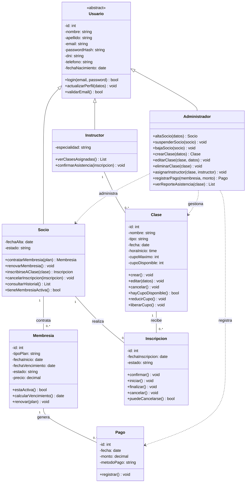

# Diagrama de Clases — Target GYM

## 1. Entidades principales identificadas

A partir de las funcionalidades, reglas de negocio y tipos de usuario descriptos en [TargetGYM.md](TargetGYM.md), se identificaron las siguientes entidades:

- **Usuario** (clase base abstracta) → especializada en **Administrador**, **Socio** e **Instructor**
- **Membresia**: plan contratado por un socio (mensual, trimestral, anual)
- **Clase**: actividad grupal con horario, cupo e instructor asignado
- **Inscripcion**: vínculo entre un Socio y una Clase, con su flujo de estados
- **Pago**: registro de pago de una cuota/membresía

## 2. Diagrama (Mermaid)

Podés pegar este bloque en [mermaid.live](https://mermaid.live) para visualizarlo y exportarlo como imagen, o abrirlo directamente en VS Code con la extensión de Mermaid.

## 3. Relaciones clave

| Relación | Tipo | Cardinalidad | Descripción |
| --- | --- | --- | --- |
| Usuario → Administrador / Socio / Instructor | Herencia | 1 | Los tres roles comparten datos base (nombre, email, login, etc.) |
| Socio → Membresía | Asociación | 1 a muchas | Un socio contrata planes a lo largo del tiempo (historial de membresías) |
| Membresía → Pago | Asociación | 1 a muchas | Cada membresía puede tener uno o varios pagos registrados |
| Socio → Inscripción | Asociación | 1 a muchas | Un socio puede inscribirse a varias clases |
| Clase → Inscripción | Asociación | 1 a muchas | Una clase tiene muchos socios inscriptos (limitado por cupo) |
| Instructor → Clase | Asociación | 1 a muchas | Un instructor dicta varias clases |
| Administrador → Clase / Socio / Pago | Dependencia | — | El administrador opera sobre estas entidades pero no las "posee" |

## 4. Notas sobre reglas de negocio reflejadas en el diagrama

- `Socio.tieneMembresiaActiva()` y `Clase.hayCupoDisponible()` son los guards que controlan la regla de "no inscripción sin cupo" y "solo socios activos".
- El estado de `Inscripcion` (Pendiente → Confirmada → En curso → Finalizada/Cancelada) se modela como atributo `estado`, con métodos que representan las transiciones válidas.
- `Inscripcion.puedeCancelarse()` encapsula la regla de las 2 horas de anticipación.
